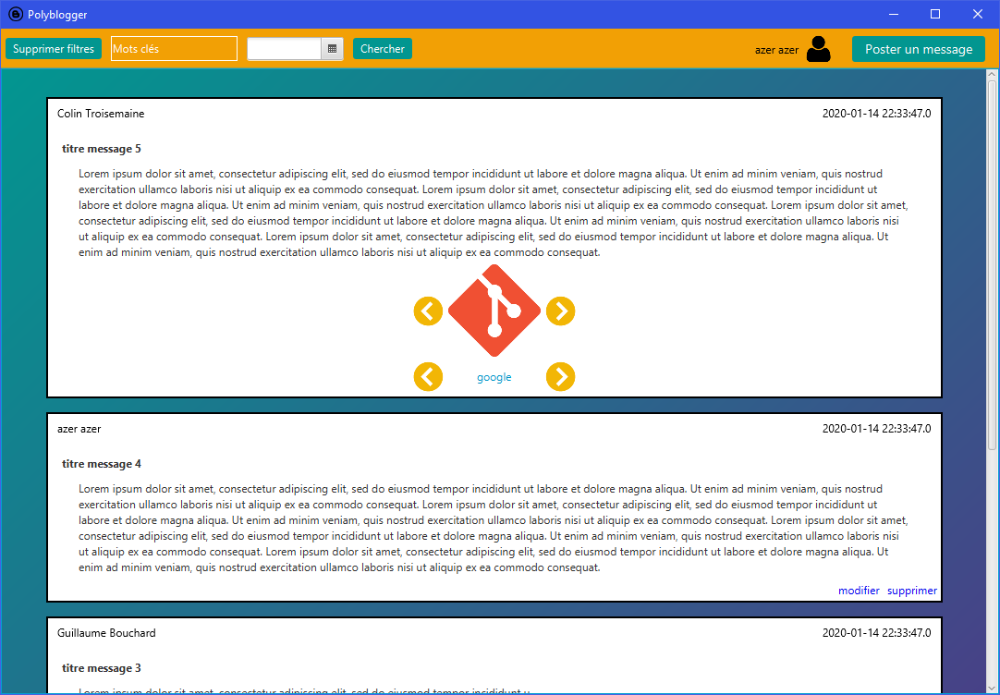
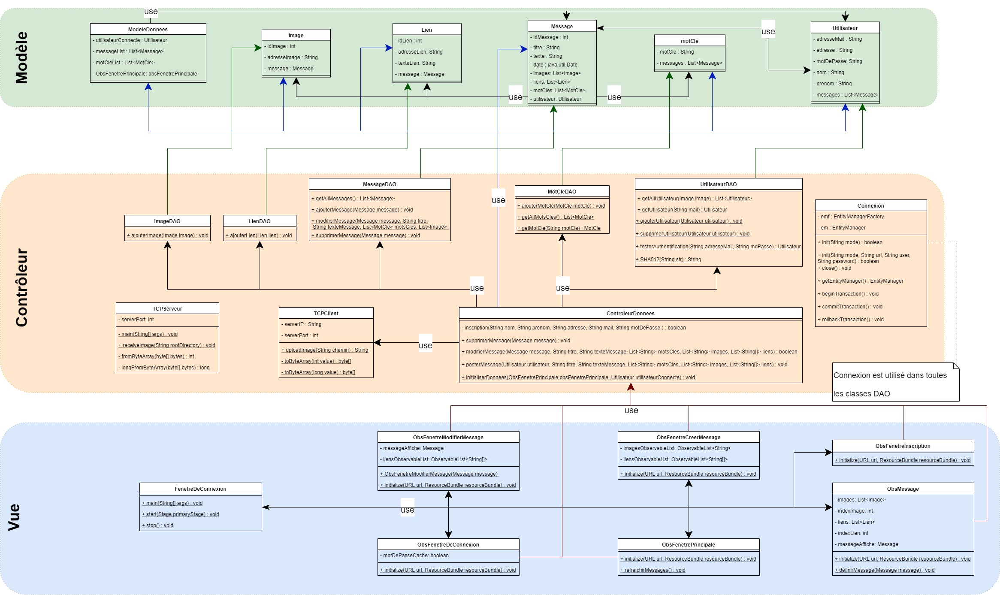

# ProjetS7Blog

Colin Troisemaine - Guillaume Bouchard
10/01/2020

# Liens SGBD-LOO : Blog

_Fenêtre principale de l’application_

**A) Contraintes :**
1) Connexion à la base de données :
Pour que l’application fonctionne, il suffit d’avoir une table nommée “projet_blog_hibernate” à l’adresse 127.0.0.1 qui soit disponible. L’application pourra marcher même si la table car nous avons choisi la valeur update pour la propriété hbm2ddl.auto. De cette manière si les tables n’existent pas elles seront crées et l’application pourra fonctionner.
Ce choix de valeur va écrire de nombreux WARN dans la console à l’initialisation de l’application si les tables existent déjà, mais cela n’a pas de réelle importance.

2) Envoi d’images :
Pour pouvoir utiliser la fonction de mise en ligne d’images de notre application, il faut précedemment avoir lancé une instance de TCPServeur.main() et avoir sur ce serveur un répertoire à l’adresse “C:\Images”. Le client TCP va essayer d’envoyer ses fichiers à l’adresse 127.0.0.1 par le port 4444 de base.

3) Adresse Email unique :
Comme chaque utilisateur possédait une adresse Email, nous avons choisi
de nous en servir comme d’un identifiant. Logiquement, chaque Email doit être unique dans
la base de données. À l’inscription, il est donc impossible de créer un compte avec une
adresse Email déjà présente dans la BDD.

4) Bibliothèques :
Pour pouvoir compiler notre projet, il faut les quatre bibliothèques suivantes :

- hibernate_requierd
- mysql-connector-java-8.
- javafx
- jfoenix-9.0.

**B) Architecture du logiciel :**

**C) Spécifications techniques :**

***Gestion de la connection à la base de données :***
Nous avons choisi d’utiliser une classe Connexion pour gérer toutes les connections à notre base de données. Cette classe possède un EntityManagerFactory et un EntityManager statiques qui sont ouvert à la première connection de l’application et qui seront fermé à sa fermeture. Ainsi, tous les objets que nous manipulons sont persistants.

***Suivi du modèle MVC :***
Pour que notre application soit attrayante, nous avons choisi d’utiliser JavaFX. Pour suivre le paterne MVC, nous avons donc ajouté aux ressources les classes .fxml qui ne sont pas du code Java et représentent la disposition des fenêtres. Et les classes qui permettent de définir les actions des boutons, champs de texte, tableaux, etc ... ont logiquement été placées dans la vue (vue.javafxobservers).

***Connexion à l’application :***
Pour se connecter à l’application, nous avons choisi d’utiliser le mail et le mot de passe qui sont 2 attributs imposés par le sujet.

***Manipulation des mots-clés :***
Quand l’utilisateur renseigne les mots-clés associés à son message, le programme va regarder pour chaque mot-clé s’il n’existe pas déjà dans la table des mots-clés. S'ils n’existent pas ils sont créés, et dans tous les cas ils sont associés au nouveau message.

***ManipulationUtilisateur :***
Cette classe contient les méthodes qui font le lien entre les actions que la vue détecte les données. Les données qu’elle manipule sont donc celles de la BDD en appelant les méthodes des classes DAO et les données “locales” de la classe ModeleDonnees. Exemple de la méthode d’inscription : Cette méthode n’est pas dans la classe UtilisateurDAO car elle n’est pas une simple fonction de gestion de la base de donnée mais une méthode plus complexe qui vérifie si le mail du compte que l’on souhaite créer n’est pas déjà utilisé puis on l’ajoute à la bdd.

***Modification/Suppression d’un message :***
Pour les fonctions de modification et de suppression d’un message, nous avons choisi de faire en sorte de rajouter des boutons sur tous les message que l’utilisateur actuellement connecté a posté (voir photo page 1). De cette manière, l’utilisateur connecté ne peut pas modifier ou supprimer les messages qu’il n’a pas posté et peut le faire pour ses propres messages.

***Création d’un nouveau message :***
Pour créer un message, nous n’avons pas choisi de mettre de contraintes sur les différents champs de la fenêtre permettant de modifier un message. Ainsi, il est possible de poster un message vide. Il ne possédera donc que la date et l’utilisateur qui l’a posté. Il est donc possible de rajouter des nouvelles images et des nouveaux liens à son message. Lorsque le message est créé à l’aide la méthode ManipulationUtilisateur.posterMessage, on regarde si les mots-clés existent déjà ou non dans la base de données. S'ils n’existent pas ils sont créés, et si ils existent ils sont simplement associés au message. Pour ***modifier un message***, la même fenêtre s’affiche mais avec les champs pré-remplis.

***Fonction de recherche de messages :***
Pour implémenter les fonctions de recherche par date et par mots-clés, nous avons choisi de placer deux champs différents en haut de notre fenêtre :
- Un champ texte où il est possible de rentrer des mot-clés (séparés par un espace).
- Un champ pour sélectionner une date dans un calendrier ou entrer la date à la main.
Ainsi, si les deux champs sont remplis, l’application cherchera les messages postés à la date entrée et contenant les mots-clés entrés (il est bien sûr possible de se servir de l’un OU de l’autre indépendamment). Pour afficher l’ensemble des messages, il suffit de cliquer sur “Supprimer filtres”.

